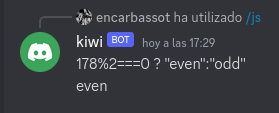

# discord-bot-server-controll
This discor bot is util to manage your server

## Servers with dinamic IP

the command **/ip** returns the current ip of the server.

## Ping command

the command **/ping** returns the time that takes the server to get the petition

## execute Bash script

in case that you are not able to use SSH, or if you are with your phone you can run commands with the 

## execute JS

also you can execute JS, i dont know the applications but here it is in case you need it.

## protected commands
in the `.env` has **ADMIN_ID** property that specifies the user id that is the admin of it. only this person will be able to execute this commands.

# How to create your bot

yoy can follow the oficial documentation [here](https://discord.com/developers/docs/intro)

### 1. create a bot
go to [developers applications](https://discord.com/developers/applications), **New application**  and create your bot with name and picture you want.

**OAuth2** >> **URL Generator** >> select **bot**

then you can copy the url and open it, it will ask to add the bot to a server.

### 2. clone this project
`git clone https://github.com/encarbassot/discord-bot-server-controll.git`
then you must rename the file `.env.sample` to `.env`
and edit its values.
from the developer portal you can get the **CLIENT_ID** and **TOKEN**
- **CLIENT_ID** in the page **general information** in the developers portal, copy **APPLICATION ID**
- **CLIENT_ID** go to the **bot** page in the developers portal and click regenerate token
- **ADMIN_ID** its the ID of your user. 

(*) to activate **developer options** go to **settings** >> **advanced** >> **developer mode**

### 3. run the project

first of all you must declare to discord the commands you are using, for this you must execute `npm run deploy-commands` this will execute the file **deploy-commands.js** this reads the array `commands`from **index.js** that contains all commands

once deployed the project you can run it using `npm run dev` or `npm run start`.
if you want to use it in your server considere using [pm2](https://www.npmjs.com/package/pm2)